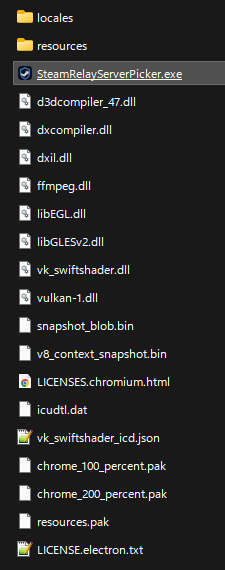
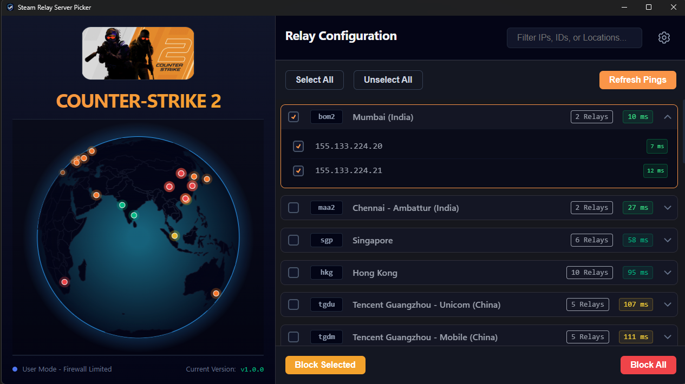
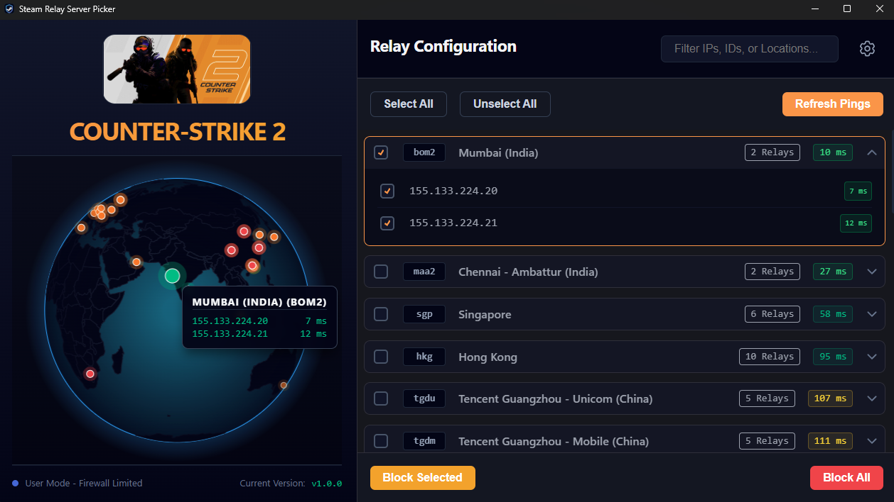
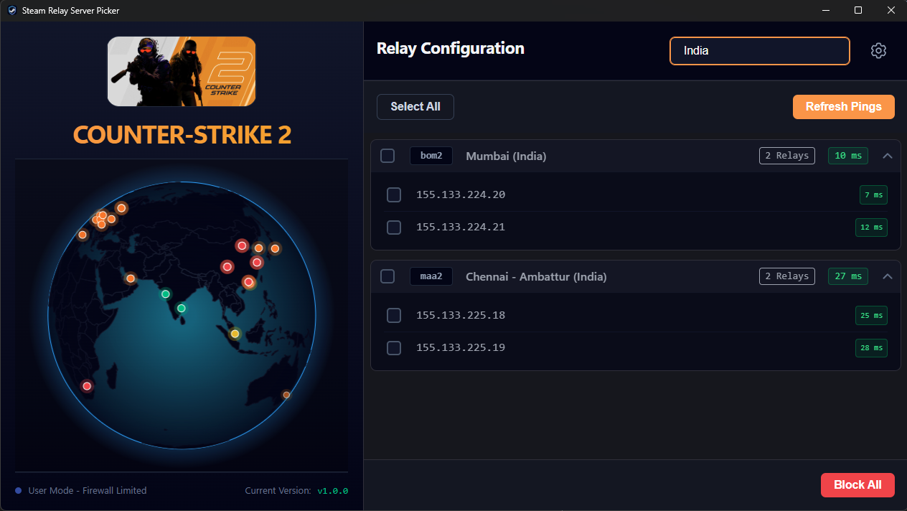
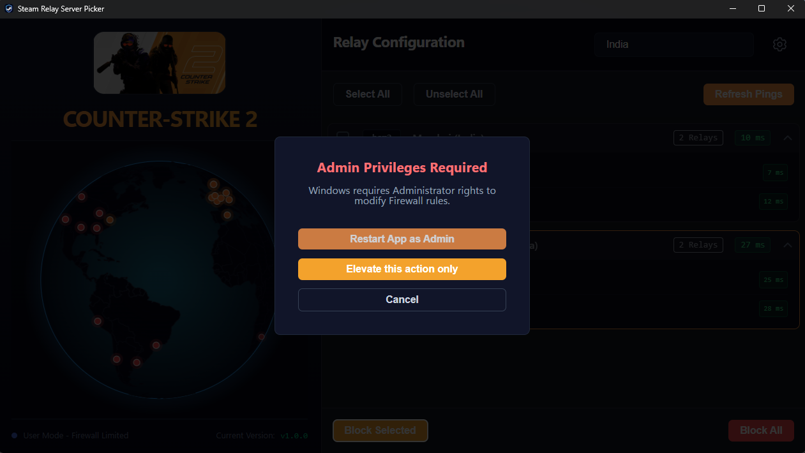
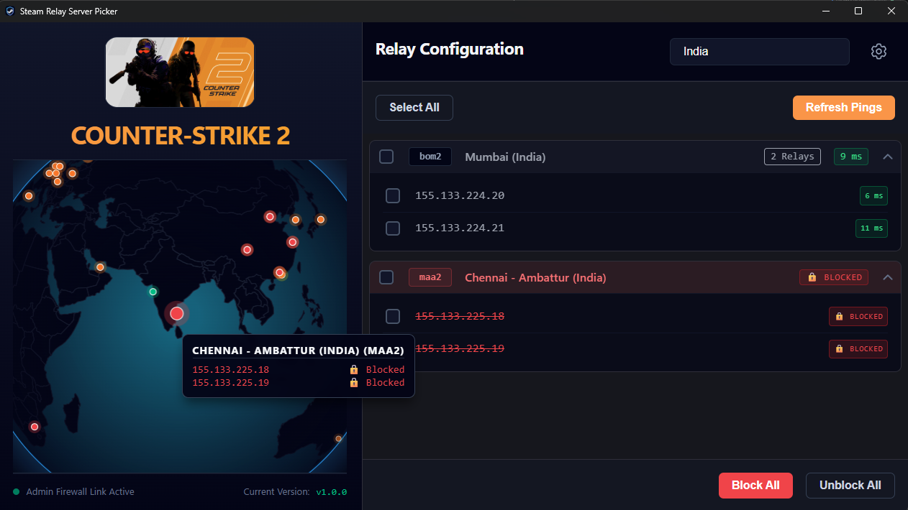
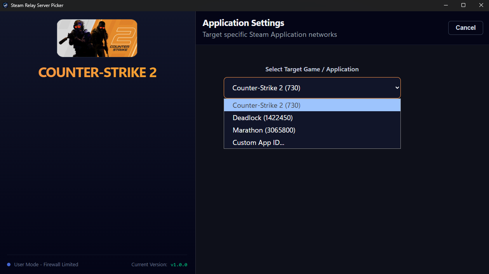

# [Steam Relay Server Picker](https://akshaybhanawala.github.io/SteamRelayServerPicker/)

<p align="center">
	<a target="_new" href="https://akshaybhanawala.github.io/SteamRelayServerPicker/icons/icon_256x256.png">
		
	</a>
</p>

---

### 🌐 [Try the Live Web Demo here!](https://akshaybhanawala.github.io/SteamRelayServerPicker/)

_(Web demo is just for preview. The web demo runs in a restricted "Diagnostic Mode" using simulated pings due to browser CORS and network limitations. And It can not modify any firewall rules as well. Please download the full desktop app from **[GitHub Releases Page](https://github.com/AkshayBhanawala/SteamRelayServerPicker/releases/)** for full experience.)._

---

## 🌟 Overview

Steam Relay Server Picker is an Electron-based desktop application designed to help competitive gamers monitor and control their connection to Steam's worldwide datagram relay infrastructure.

It visualizes real-time pings on an interactive, fully rotatable 3D holographic globe and allows Windows users to selectively block routing to specific data centers, forcing game matchmaking to connect you to your preferred regions.

## ✨ Features

- **📡 Live Ping Diagnostics:** Multithreaded ICMP pinging to map your actual latency to global Steam datacenters.
- **🛡️ Windows Firewall Integration:** One-click blocking/unblocking of specific datacenters to avoid high-ping routing.
* **✏️ Custom Steam AppID:** Allows to use custom steam App ID to manage it's servers.
- **🌍 3D Holographic Globe:** Built with D3.js and Canvas, rendering global server nodes in real-time.

---

## 🎮 Supported Games & How It Works

Out of the box, the app includes quick-select profiles for popular games utilizing Valve's SDR network:

- **Counter-Strike 2** (App ID: `730`)
- **Deadlock** (App ID: `1422450`)
- **Marathon** (App ID: `3065800`)

**Want to play another game?**
You can easily target other games! Simply select **"Custom App ID..."** in the settings menu and type in the Steam App ID of your desired game (e.g., `570` for Dota 2, `440` for Team Fortress 2). As long as the game officially uses the Steam Datagram Relay (SDR) protocol for its multiplayer routing, the app will successfully pull its server list.

**Under the Hood (API):**
To ensure server clusters and IPs are always accurate and up-to-date, this application directly queries the official Steam Web API endpoint: `ISteamApps/GetSDRConfig/v1`. This returns the live, dynamic network configuration, geographic coordinates, and relay IPv4 pools for the specified game.

---

## 💻 System Requirements & Testing Status

| Operating System | Minimum Requirement        | Testing Status                                     |
| ---------------- | -------------------------- | -------------------------------------------------- |
| **Windows**      | Windows 10 / 11 (64-bit)   | ✅ **Fully Tested & Supported (Tested on Win 11)** |
| **Linux**        | Ubuntu 20.04 or equivalent | ⚠️ **Untested / Unverified**                       |

_Note: While automated builds are generated for Linux, Currently I've only tested the application on Windows 11. Linux builds are provided "as-is"._

---

## 📥 Downloads & Installation

You can download the latest compiled executables for your operating system from the **[GitHub Releases Page](https://github.com/AkshayBhanawala/SteamRelayServerPicker/releases/)**.

### 🪟 Windows (Fully Supported)

1. Download the `SteamRelayServerPicker-Setup-1.0.0.exe` file.
2. Run the installer.
3. **Usage:** You can use the app normally to view pings. If you wish to apply Firewall blocks, the app will automatically prompt you to restart with **Administrator Privileges**.

### 🐧 Linux (Diagnostic Mode Only)

1. Download the `SteamRelayServerPicker-1.0.0.AppImage` file.
2. Make it executable:

```bash
   chmod +x SteamRelayServerPicker-1.0.0.AppImage
```

3. Run the AppImage. _(See Platform Limitations below)._

---

## ⚠️ Platform Limitations: Why Windows Gets "Admin" Controls

If you are using **Linux**, you will notice the app boots into a restricted **"Diagnostic Mode"** where the Firewall blocking features are disabled.

**Why did I do this?**
On Windows, controlling network traffic programmatically is heavily standardized. The app can safely request UAC (User Account Control) Administrator elevation and inject clean, temporary routing rules into the Windows Defender Firewall via the native `netsh` command.

On Linux, managing the firewall programmatically is significantly more destructive, permanent, and fragmented:

- **Linux** distributions are fragmented across `iptables`, `ufw`, `firewalld`, and `nftables`. Writing a universal, fail-safe script that requires `sudo` privileges across every Linux distro is highly unstable and dangerous.

Rather than risk permanently damaging your operating system's network configuration, the Linux builds are gracefully limited to **Diagnostic Mode**. You can still use the beautiful 3D globe to measure and visualize your real-time latencies to global Steam servers, but automated IP blocking is exclusively available on Windows.

---

## 📸 Screenshots

<p align="center">
	<a target="_new" href="https://akshaybhanawala.github.io/SteamRelayServerPicker/images/01.App-Windows-DownloadedFiles.png">
		
	</a>
</p>
<p align="center">
	<a target="_new" href="https://akshaybhanawala.github.io/SteamRelayServerPicker/images/02.App-Windows-Dashboard-Basic.png">
		
	</a>
</p>
<p align="center">
	<a target="_new" href="https://akshaybhanawala.github.io/SteamRelayServerPicker/images/03.App-Windows-Dashboard-MapDotHover.png">
		
	</a>
</p>
<p align="center">
	<a target="_new" href="https://akshaybhanawala.github.io/SteamRelayServerPicker/images/04.App-Windows-Dashboard-LocationFilter.png">
		
	</a>
</p>
<p align="center">
	<a target="_new" href="https://akshaybhanawala.github.io/SteamRelayServerPicker/images/05.App-Windows-ApplyRuleFromNonAdminAppLaunch.png">
		
	</a>
</p>
<p align="center">
	<a target="_new" href="https://akshaybhanawala.github.io/SteamRelayServerPicker/images/06.App-Windows-DashboardWithBlockedLocation.png">
		
	</a>
</p>
<p align="center">
	<a target="_new" href="https://akshaybhanawala.github.io/SteamRelayServerPicker/images/07.App-Windows-Settings.png">
		
	</a>
</p>

---

## 🛠️ Development & Building from Source

This project uses **Vue 3**, **Vite**, **TypeScript**, **D3.js**, and **Electron**.

### Prerequisites

- Node.js (v18 or higher)
- npm

### Local Setup

```bash
# Clone the repository
git clone https://github.com/AkshayBhanawala/SteamRelayServerPicker.git
cd SteamRelayServerPicker

# Install dependencies
npm install
```

### Running the App Locally

```bash
# Run the Vue dev local server (with hot-reload)
npm run dev:web

# Run the Vue dev local Electron App (with hot-reload)
npm run dev:electron
```

### Building the App

```bash
# Build the Electron executables (outputs to release/ folder)
npm run build:electron

# Build the Web-Only Static Demo (outputs to dist/ folder)
npm run build:web
```

---

## ⚖️ Disclaimers & Privacy Policy

**Branding Disclaimer:** The icon used in this application is derived from the official Steam application branding. This tool is a personal project inspired by other community projects and ideas, and is **not affiliated with, endorsed by, or sponsored by Valve Corporation.** Steam and the Steam logo are trademarks and/or registered trademarks of Valve Corporation in the U.S. and/or other countries.

**Privacy Policy:** This application **does not collect any kind of data from the user, or execute any remote code on the system.** Read the entire privacy policy [HERE](https://akshaybhanawala.github.io/SteamRelayServerPicker/PrivacyPolicy.html).

---

<br /><br /><br /><br /><br /><br /><br /><br /><br /><br /><br />

<details>
	<summary>Tags</summary>
	Steam Server Picker, SDR Server Picker, CS2 Server Picker, Deadlock Server Picker, Steam Datagram Relay Network, Matchmaking Region Blocker, Ping Optimizer, CS:GO Server Picker Alternative, Block Steam Servers, Electron, Vue 3, D3.js 3D Globe.
</details>
