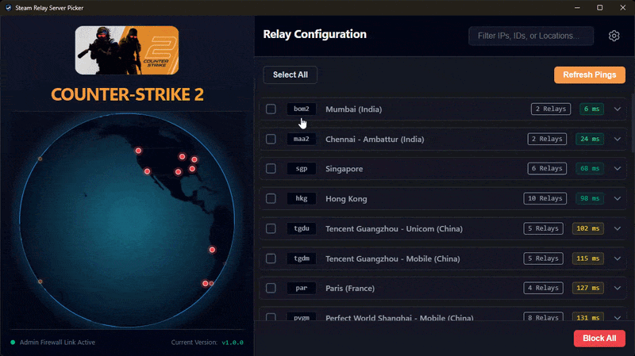

<details>
	<summary></summary>
	CS2 Server Picker |
	Deadlock Server Picker |
	Marathon Server Picker |
	Steam Relay Server Picker |
	Steam Server Picker |
	SDR Server Picker |
	Steam Datagram Relay Network |
	Matchmaking Region Blocker |
	MM Region Blocker |
	Ping Optimizer |
	CS:GO Server Picker Alternative |
	Block Steam Servers |
	Block Steam Region Servers |
	Electron |
	Vue 3 |
	D3.js |
	3D Globe |
</details>

---

# [Steam Relay Server Picker](https://akshaybhanawala.github.io/SteamRelayServerPicker/)

<p align="center">
	<a target="_new" href="https://akshaybhanawala.github.io/SteamRelayServerPicker/icons/icon_256x256.png">
		
	</a>
</p>


## 🌐 [Try the Live Web Demo here!](https://akshaybhanawala.github.io/SteamRelayServerPicker/)

_(Web demo is just for preview. The web demo runs in a restricted "Diagnostic Mode" using simulated pings due to browser CORS and network limitations. And It can not modify any firewall rules as well. Please download the full desktop app from **[GitHub Releases Page](https://github.com/AkshayBhanawala/SteamRelayServerPicker/releases/)** for full experience.)._


## 🪧 [Windows Desktop App Demo](https://akshaybhanawala.github.io/SteamRelayServerPicker/videos/App-Windows-Demo.mp4)
<p align="center">
	<a href="https://akshaybhanawala.github.io/SteamRelayServerPicker/videos/App-Windows-Demo.mp4" target="_new">
		
	</a>
</p>


## 🌟 Overview

Steam Relay Server Picker is an Electron-based desktop application designed to help competitive gamers monitor and control their connection to Steam's worldwide datagram relay infrastructure.

It visualizes real-time pings on an interactive, fully rotatable 3D holographic globe and allows Windows users to selectively block routing to specific data centers, forcing game matchmaking to connect you to your preferred regions.


## ✨ Features

* **📡 Live Ping Diagnostics:** Multithreaded ICMP pinging to map your actual latency to global Steam datacenters.
* **🛡️ Windows Firewall Integration:** One-click blocking/unblocking of specific datacenters to avoid high-ping routing.
* **✏️ Custom Steam AppID:** Allows to use custom steam App ID to manage it's servers.
* **🌍 3D Holographic Globe:** Built with D3.js and Canvas, rendering global server nodes in real-time.


## 🎮 Supported Games & How It Works

Out of the box, the app includes quick-select profiles for popular games utilizing Valve's SDR network:

* **Counter-Strike 2** (App ID: `730`)
* **Deadlock** (App ID: `1422450`)
* **Marathon** (App ID: `3065800`)

**Want to play another game?** \
You can easily target other games! Simply select **"Custom App ID..."** in the settings menu and type in the Steam App ID of your desired game (e.g., `570` for Dota 2, `440` for Team Fortress 2). As long as the game officially uses the Steam Datagram Relay (SDR) protocol for its multiplayer routing, the app will successfully pull its server list.

**Under the Hood (API):** \
To ensure server clusters and IPs are always accurate and up-to-date, this application directly queries the official Steam Web API endpoint: `ISteamApps/GetSDRConfig/v1`. This returns the live, dynamic network configuration, geographic coordinates, and relay IPv4 pools for the specified game.


## 💻 System Requirements & Testing Status

| Operating System | Minimum Requirement | Testing Status |
| --- | --- | --- |
| **Windows** | Windows 10 / 11 (64-bit) | ✅✅✅ **Fully Tested & Supported (Tested on Win 11)** |
| **Linux** | Ubuntu 20.04 or equivalent | ✅ **Tested on 1 device - Linux Mint with `nftables` firewall** |
| **macOS** | macOS 10.15 (Catalina) or later | ✅ **Tested on 1 device - M3 MacBook Pro running macOS 26 Tahoe with `pf` firewall** |

***Note:** While automated builds are generated for macOS and Linux, Currently I've only tested the application on 1 device each. Please verify based on which firewall your system is using.*


## 📥 Downloads & Installation

You can download the latest compiled executables for your operating system from the **[GitHub Releases Page](https://github.com/AkshayBhanawala/SteamRelayServerPicker/releases/)**.

### 🪟 Windows (Fully Supported)

1. Download the `SteamRelayServerPicker-X.X.X-win-x64.zip` file.
2. Extract wherever your heart desires.
3. Run `SteamRelayServerPicker.exe` file.
4. **Usage:** You can use the app normally to view pings. If you wish to apply Firewall blocks, the app will automatically prompt you to restart with **Administrator Privileges**.

### 🐧 Linux (Tested on Linux Mint - `nftables` firewall)
1. Download the `SteamRelayServerPicker-X.X.X-linux-x86_64.AppImage` file.
2. Make it executable:
```bash
chmod +x SteamRelayServerPicker-X.X.X-linux-x86_64.AppImage
```
3. Run the AppImage. *(See Platform Limitations below).*
- **Zip** file for linux is also available for download. Extract and run the `steam-relay-server-picker` as an executable.

### 🍎 macOS (Tested on M3 MacBook Pro running macOS 26 Tahoe)

1. Download the `SteamRelayServerPicker-X.X.X-mac.dmg` file and drag the app to your Applications folder.
2. **Apple Gatekeeper Bypass:** Because this app is currently unsigned, macOS may tell you that the app is "damaged." This is standard for indie open-source apps. To fix this, open your Terminal and run:

```bash
xattr -cr /Applications/SteamRelayServerPicker.app
```
3. Open the app. *(See Platform Limitations below).*
- **Zip** file for macOS is also available for download. Extract and run the app.

## ⚠️ Platform Limitations: Why Windows Gets "Admin" Controls

If you are using **macOS** or **Linux**, you will notice the app boots into a warning where you are instructed to allow `root`/`sudo`. \
Each and every operation that application will do, will require you to allow `root`/`sudo` access. \
Operations that will require `root`/`sudo` are as follows:
- Fetching currently blocked IP address from firewall rules
- Modifying rules that block IP address in firewall - adding/deleting rules

I have tried my best to minimize the amount of elevated request popups.

#### Why did I do this?
On Windows, controlling network traffic programmatically is heavily standardized. The app can safely request UAC (User Account Control) Administrator elevation and inject clean, temporary routing rules into the Windows Defender Firewall via the native `netsh` command. And unlike **Linux** or **macOS**, you can read firewall rules without elevated access request.

On macOS and Linux, managing the firewall programmatically is significantly more destructive, permanent, and fragmented:

* **macOS** uses `pf` (Packet Filter), which requires modifying root-level configuration files that can easily break a user's entire network stack if not handled properly.
* **Linux** distributions are fragmented across `iptables`, `ufw`, `firewalld`, and `nftables`. Writing a universal, fail-safe script that requires `sudo` privileges across every Linux distro is highly unstable and dangerous. This application uses `nftables`, so if your linux distro uses it, then it should work for you!


## 📸 Screenshots

<p align="center">
	<a target="_new" href="https://akshaybhanawala.github.io/SteamRelayServerPicker/images/01.App-Windows-DownloadedFiles.png">
		
	</a>
</p>
<p align="center">
	<a target="_new" href="https://akshaybhanawala.github.io/SteamRelayServerPicker/images/02.App-Windows-Dashboard-Basic.png">
		
	</a>
</p>
<p align="center">
	<a target="_new" href="https://akshaybhanawala.github.io/SteamRelayServerPicker/images/03.App-Windows-Dashboard-MapDotHover.png">
		
	</a>
</p>
<p align="center">
	<a target="_new" href="https://akshaybhanawala.github.io/SteamRelayServerPicker/images/04.App-Windows-Dashboard-LocationFilter.png">
		
	</a>
</p>
<p align="center">
	<a target="_new" href="https://akshaybhanawala.github.io/SteamRelayServerPicker/images/05.App-Windows-ApplyRuleFromNonAdminAppLaunch.png">
		
	</a>
</p>
<p align="center">
	<a target="_new" href="https://akshaybhanawala.github.io/SteamRelayServerPicker/images/06.App-Windows-DashboardWithBlockedLocation.png">
		
	</a>
</p>
<p align="center">
	<a target="_new" href="https://akshaybhanawala.github.io/SteamRelayServerPicker/images/07.App-Windows-Settings.png">
		
	</a>
</p>


## 🛠️ Development & Building from Source

This project uses **Vue 3**, **Vite**, **TypeScript**, **D3.js**, and **Electron**.

### Prerequisites

* Node.js (v18 or higher)
* npm

### Local Setup

```bash
# Clone the repository
git clone https://github.com/AkshayBhanawala/SteamRelayServerPicker.git
cd SteamRelayServerPicker

# Install dependencies
npm install
```

### Running the App Locally

```bash
# Run the Vue dev local server (with hot-reload)
npm run dev:web

# Run the Vue dev local Electron App (with hot-reload)
npm run dev:electron
```

### Building the App

```bash
# Build the Electron executables (outputs to release/ folder)
npm run build:electron

# Build the Web-Only Static Demo (outputs to dist/ folder)
npm run build:web
```


## ⁉️ FAQs
- **Is this fully Vide Coded?** \
It's AI Assisted. I have used Google Gemini to sort out some math for the globe animation, and to write parts of this readme. All the firewall rules research was done solely by me for the implementation for each OS that I've worked with.

- **Linux Support?** \
I got access to one device With Linux Mint which has `nftables` firewall. Based on that I've updated the app to support the same firewall. If you have any Linux Distro that does not have `nftables` command for firewall management, then I apologize, this app will not work for you!

- **MacOS Support?** \
For MacOS, please keep in mind that the App will be unsigned, please follow above mentioned 'Apple Gatekeeper Bypass'. The process for building an app that is easily accepted by macOS, requires signing the App with valid Mac Developer Certificate which costs payment $99 per year. And I currently do not have the means. My Apologies. I have tested the App on 1 macOS device that I had access to. App was tested on M3 MacBook Pro running macOS 26 Tahoe.

- **Whats different from other available app?** \
As far as features go, I did not see any other app allowing you to configure any desired Steam SDR supported game automatically. So that is new. Which can be useful if you are playing anything other than CS2, Deadlock and Marathon. \
Other than that, It's just fun to look at the globe. \
If it's not you, then I believe you can take any other available similar app. You can easily google/search "{Your game name} Server Picker" eg. "CS2 Server Picker", which will show you apps that can help you in that. But first make sure you verify that that application is trusted or not; for your own sake!

- **Where to change the game from?** \
There is a Settings icon on top right of the window, clicking that will lead you to settings page. There you can select your game or add custom Steam App ID. Though If your game do not support Steam SDR, it will not work for you I am afraid.

- **Design inspiration?** \
Not one, but many, I'm a developer not a designer, but I do look at designs sometimes to get inspiration for my projects. It just helps envision what I want my thing to look like!

## ⚖️ Disclaimers & Privacy Policy

**Branding Disclaimer:** The icon used in this application is derived from the official Steam application branding. This tool is a personal project inspired by the need to play with specific region, other community projects and ideas, and is **not affiliated with, endorsed by, or sponsored by Valve Corporation.** Steam and the Steam logo are trademarks and/or registered trademarks of Valve Corporation in the U.S. and/or other countries.

**Privacy Policy:** This application **does not collect any kind of data from the user, or execute any remote code on the system.** Read the entire privacy policy [HERE](https://akshaybhanawala.github.io/SteamRelayServerPicker/PrivacyPolicy.html).
